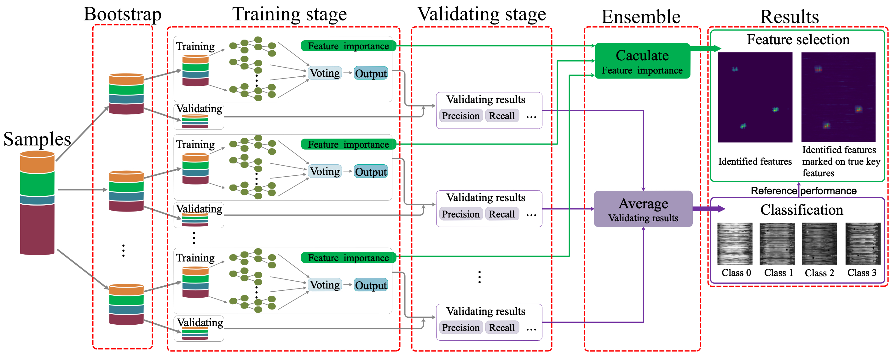

# Random forest-integrated analysis in AD and LATE brain RNA-seq datasets to identify disease-specific gene expression (PLOS ONE 2021)

> Alzheimer's disease (AD) is a complex neurodegenerative disorder that affects thinking, memory, and behavior. Limbic-predominant age-related TDP-43 encephalopathy (LATE) is a recently identified common neurodegenerative disease that mimics the clinical symptoms of AD. The development of drugs to prevent or treat these neurodegenerative diseases has been slow, partly because the genes associated with these diseases are incompletely understood. Further, usually, the clinical samples for patients and controls are highly imbalanced, thus rendering it challenging to apply most existing machine learning algorithms to directly analyze such datasets. More specific disease-associated gene identification may enable new insights into underlying disease-driving mechanisms, perhaps help find biomarkers and improve prospects for effective treatment strategies.
 
>In order to detect disease-associated genes based on imbalanced transcriptome-wide data, we proposed an integrated multiple random forests (IMRF) algorithm. IMRF is effective in differentiating putative genes associated with subjects having LATE and/or AD from controls based on transcriptome-wide data, thereby enabling effective discrimination between these samples. Various forms of validations, such as cross-domain verification of our method over other datasets, improved and competitive classification performance by using identified genes, effectiveness of testing data with a classifier that is completely independent from decision trees and random forests, and relationships with prior AD and LATE studies on the genes linked to neurodegeneration, all testify to the effectiveness of IMRF in identifying genes with altered expression in LATE and/or AD. We conclude that IMRF, as an effective feature selection algorithm for imbalanced data, is promising to facilitate the development of new gene biomarkers as well as targets for effective strategies of disease prevention and treatment.

--

Note:  If you are interested in getting the codes and results of the experiments and comparisons on AD and LATE brain RNA-seq, please feel free to contact the authors.

---

##### Overall scheme of IMRF. As an illustration, we show the use of IMRF on synthetic data with or without tiny black points for visualization.

     
 

---

##### The procedure for calculation of feature importances from multiple RFs.

     
 

 
 
---

## How to Cite

Wu X, Peng C, Nelson PT, Cheng Q (2021) Random forest-integrated analysis in AD and LATE brain transcriptome-wide data to identify disease-specific gene expression. PLOS ONE 16(9): e0256648. https://doi.org/10.1371/journal.pone.0256648

---
  
## Release History

* 0.0.1
    * ADD: Experiments on MINST, and MSBB_ArrayTissuePanel without datasets

## Contacts

Xinxing Wu (xinxingwu@gmail.com) and Qiang Cheng (qiang.cheng@uky.edu)
